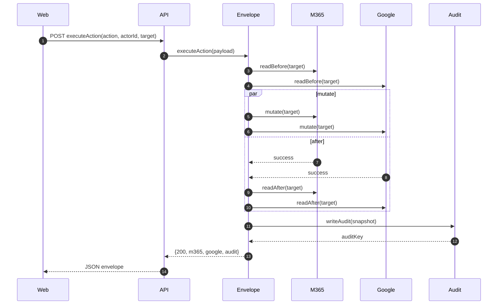
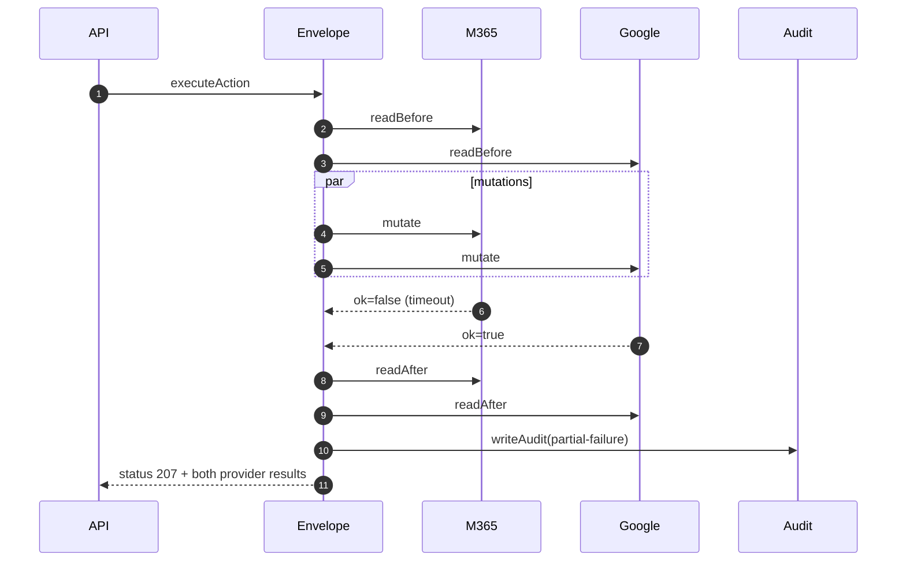
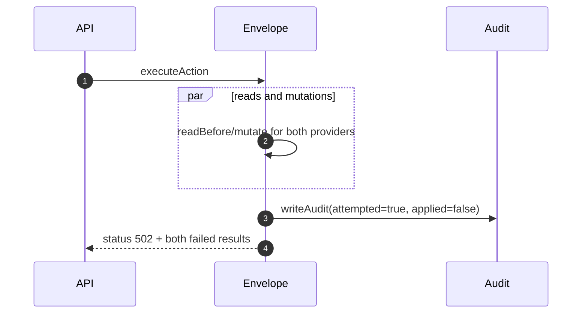

# GST-11 — Phase 1 Execute Action Envelope + Audit Writer/Reader

Scope: executeAction envelope, typed provider result contract, and dual-cloud audit pipeline.

Status assumption for this heartbeat: **no GST-11 branch/commit/PR is present in this checkout**. This document is the locked implementation plan to be used when the owning branch is provided or when implementation starts directly from `main` + GST-11 scope.

## Implementation target (locked 2026-05-28)

- Branch: `origin/gst-11-implementation-base`
- Base commit: `a60605b0eede545172f0ba17598e0b19928a79af`
- Intent: this branch is the explicit implementation base for GST-11 follow-on code and review.

## 1) Locked decisions

1. Every mutation must go through `executeAction`.
2. `readBefore` and `readAfter` are **always attempted for both providers**; one side failing read does not prevent the other side from reading and is captured in its provider result.
3. Mutations are dispatched in parallel and are **not retried automatically**.
4. No rollback/compensation is performed.
5. Audit row is always written when an action is initiated, even when both sides fail.
6. `action` result to clients:
   - both success → `200`
   - one provider fail → `207`
   - both provider failures → `502` and audit `{ attempted: true, applied: false }`
7. Append-only audit storage. No delete/update API surface.
8. Table index stores IDs + timestamps only; all payloads live in blob storage.

## 2) Intended module layout

- `packages/core/src/action/`
  - `execute-action.ts` — orchestration + failure semantics
  - `types.ts` — request/response DTOs for API + web consumption
- `packages/core/src/types.ts`
  - extend shared `AuditEntry` and provider result types as needed
- `packages/audit/`
  - `src/index.ts` — client interfaces (`auditWriter`, `auditReader`)
  - `src/writer.ts` — table+blob persistence
  - `src/reader.ts` — filtering API
  - `src/models.ts` — shared audit metadata and filters
  - `src/test/...` — Mock storage contract tests + repository tests

- `apps/api/action/`
  - HTTP route(s) call `executeAction`
  - maps exception classes/codes to HTTP status + correlation metadata

- `apps/web/` (if needed)
  - consume typed envelope for action result and audit rendering

## 3) Component diagram

```mermaid
flowchart TD
  Web[Web UI] -->|POST /api/v1/actions| API[apps/api route]
  API -->|executeAction(input)| Envelope[apps/api/action/
execute-action.ts]
  Envelope -->|readBefore| M365In[IdentityProvider:M365]
  Envelope -->|readBefore| GoogleIn[IdentityProvider:Google]
  Envelope -->|mutate Promise.all| MutM365[mutate(m365)]
  Envelope -->|mutate Promise.all| MutG[mutate(google)]
  MutM365 -->|readAfter| M365After[IdentityProvider:M365]
  MutG -->|readAfter| GoogleAfter[IdentityProvider:Google]
  Envelope -->|append audit| AuditWriter[packages/audit/writer]
  AuditWriter -->|index entry| Table[(Table Storage)]
  AuditWriter -->|blob payload| Blob[(Blob Storage)]
  API -->|typed envelope| Web
  API -->|query| AuditReader[packages/audit/reader]
  AuditReader --> Table
  AuditReader --> Blob
```

## 4) Sequence diagrams

### 4.1 success / dual success



### 4.2 one side fails during mutate



### 4.3 both fail



## 5) Data flow and state model

Core flow for each provider `P ∈ {m365, google}`:

```text
START
  -> readBefore(P)
  -> if readBefore failed: mark preReadError(P)
  -> [mutate(P)] executed in Promise.all with other provider
  -> readAfter(P)
  -> normalize ProviderResult
AGGREGATE across providers
  -> writeAudit once with both before/after + raw provider responses
  -> choose HTTP status
END
```

State enum suggestion:
- `idle`
- `snapshots_before_started`
- `mutations_inflight`
- `snapshots_after_started`
- `audit_write_inflight`
- `completed`

Failure states:
- `preflight_aborted`
- `partial_failure`
- `total_failure`

## 6) Contracts

### 6.1 `executeAction` payload

- `readBefore: ReadUserSnapshot` (provider-neutral)
- `mutate: (identityProvider, context) => Promise<ProviderResult<User>>`
- `readAfter: ReadUserSnapshot`
- `writeAudit: (auditRecord) => Promise<void>`
- `correlationId`, `actor`, `customer`, `action`, `targetKey`

Return object:
- `m365: ProviderResult<AuditEntry | UserSnapshot>`
- `google: ProviderResult<AuditEntry | UserSnapshot>`
- `audit: AuditEntry` (or envelope with `auditKey` and status metadata)

### 6.2 HTTP envelope to web

```ts
export interface ExecuteActionResponse {
  status: 200 | 207 | 502;
  correlationId: string;
  action: 'suspend' | 'resume' | 'read';
  m365: ProviderResult<ActionProviderSnapshot>;
  google: ProviderResult<ActionProviderSnapshot>;
  audit: AuditEnvelope;
}
```

## 7) Audit storage design

### 7.1 Table index (PartitionKey/RowKey)

- Table: `audit-index`
- `PartitionKey = customerId`
- `RowKey = <timestampISO>#<actorId>#<action>` or `<reverseTicks>#<action>#<actorId>` (for descending sort)
- Columns (index-only):
  - `timestamp`
  - `actorId`
  - `targetUserId`
  - `action`
  - `blobPath`
  - `status` (`attempted`,`applied`,`partial`)
  - optional `requestId`

### 7.2 Blob payload

- Container: `audit-entries`
- Path: `customers/{customerId}/events/{eventId}.json`
- Stored JSON:
  - `before` and `after` for both providers
  - `providerRequests`/`providerResponses` raw for both providers
  - redacted/metadata-only fields (no token/secrets)

### 7.3 Reader filtering

Filters supported:
- `customerId` (required)
- `targetUserId`
- `actorId`
- `action`
- `from` and `to` timestamp range

Pagination strategy:
- Table query by `customerId + timestamp` window first, then continue with continuation token.
- No offset-based slicing.
- Cursor must be opaque and signed by server.

## 8) Failure matrix + expected audit status

| Scenario | M365 | Google | HTTP | `attempted` | `applied` |
|---|---|---|---|---|---|
| success-both | ok | ok | 200 | true | true |
| partial-fail-M365 | fail | ok | 207 | true | true |
| partial-fail-Google | ok | fail | 207 | true | true |
| fail-both | fail | fail | 502 | true | false |
| timeout-one-side | fail(timeout) | ok | 207 | true | true |

## 9) Edge cases and assumptions made explicit

1. `readBefore` failure plus mutation success for same provider: record pre-state as unavailable in snapshot but still allow mutation+audit; if downstream policy forbids this, add hard fail for reads first.
2. Duplicate action retry: use idempotency key in request; default strategy is accept-first-write semantics in storage.
3. Very large payloads: cap blob payload size and allow pointer-only fallback with minimal error metadata.
4. `readAfter` must run even when mutation fails, to capture partial effect state where APIs apply best-effort changes.
5. Timeout error classification from provider adapters should map to `network_timeout`, preserving `retryable=true`.
6. All timestamps are UTC ISO-8601 with millisecond precision.
7. Actor identity is normalized user ID; no display names stored in table index.

## 10) Test matrix (minimum to ship)

### Unit / Contract
- `executeAction` success path
- `executeAction` partial failures for each side
- both-side failure path
- `readBefore` failure handling strategy
- timeout path from one side
- audit status and status-code mapping

### Integration with `MockAdapter`
- success-both
- partial-fail-M365
- partial-fail-Google
- fail-both
- timeout-one-side
- verify `writeAudit` called exactly once
- verify raw before/after blobs contain both provider payloads

### Reader tests (10k scale)
- filtering by each dimension independently and combined
- cursor pagination forward/backward in 10k dataset without row loss
- monotonicity assertion on timestamps and dedupe

### Cross-layer
- health API route returns typed envelope from `executeAction`
- web rendering path accepts `{207, 502}` as non-fatal and surfaced with per-provider badges

## 11) Hand-off and ownership

- Staff Engineer: implement `packages/core` `executeAction`, `apps/api/action`, `packages/audit` with storage adapters.
- QA Engineer: implement MockAdapter integration matrix and 10k-reader pagination tests.
- Release Engineer: provision/verify Table Storage + Blob Storage and CI permission policy.

## 12) Immediate unblock required

I could not locate a `GST-11` branch, commit, or PR in this checkout or upstream GitHub references.

Next unblock action:
1. Provide exact target branch/commit/PR for GST-11 so implementation review can be performed on that diff.
2. If no such ref exists, confirm permission for this branch to begin implementation directly from `main` using this plan.
