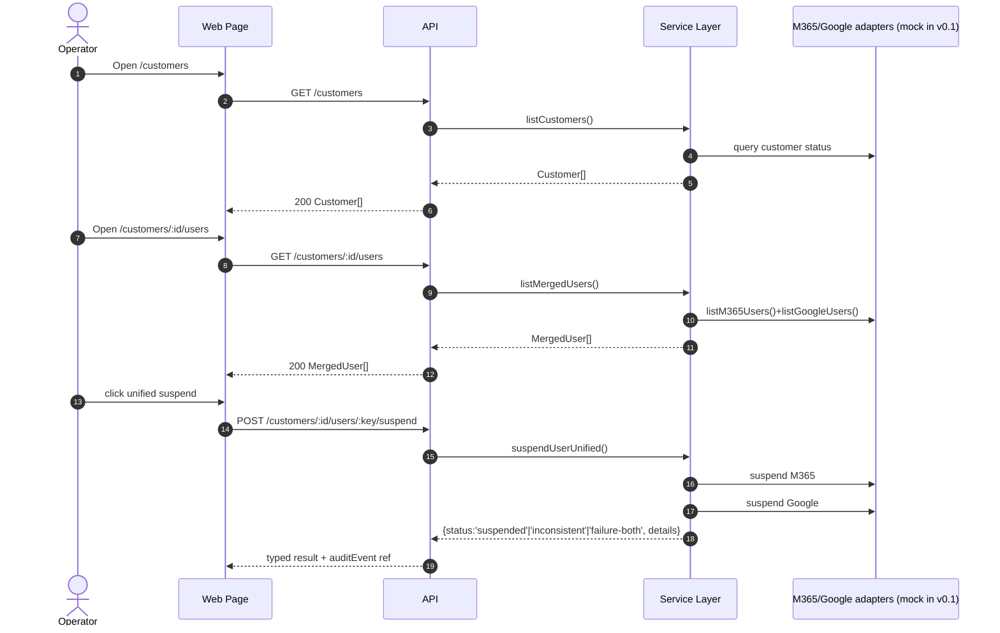
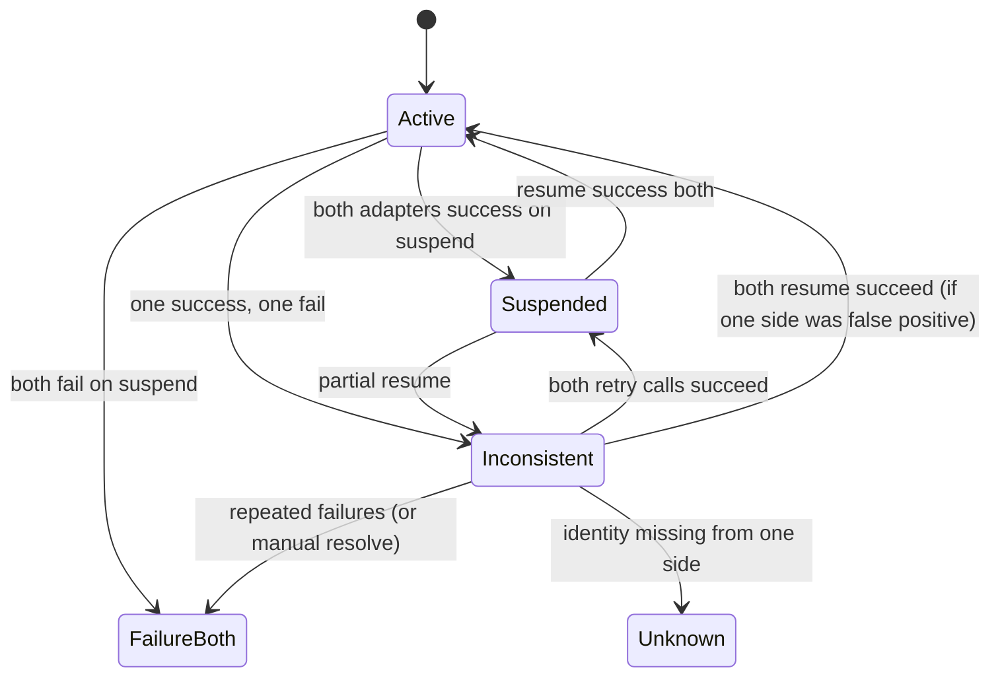

# GST-12 Phase 1 Execution Plan  
## Product: merged user list + unified suspend UI + audit page

Status: **Locked draft for implementation handoff**  
Source authority: GST-4 + this issue (`GST-12`)

## 1) Problem statement
Phase 1 must ship a deterministic v0.1 web surface for MSP operators:
- `/customers` list with per-customer binding states.
- `/customers/:id/users` merged identity list across M365 + Google.
- `/customers/:id/users/:key` user detail with suspend / resume.
- `/audit` audit table with filtering and paging.
- first-class `Inconsistent` state when one side succeeds and one side fails.
- typed machine-parseable error propagation into UI.

Current repo is scaffolding-only, so this plan treats `/apps/core` contracts and `/apps/api` and `/apps/web` implementations as new scope.

## 2) Architecture and ownership boundaries

### 2.1 Component diagram
```mermaid
graph TD
  Browser["Next.js Web UI (/apps/web)"] -->|HTTP JSON| API["Azure Functions API (/apps/api)"]
  API --> Core["Core contract package (/packages/core)"]
  Core --> UI["Shared TS models + typed errors"]
  Core --> API

  Browser -->|local dev fallback| MockAdapter["Mock adapter (feature-flagged)"]
  AuditAPI["Audit store (API)] --> API
  API --> AuditSink["Storage/queue/table (later swap)"]

  Browser -->|navigation| Customers["/customers"]
  Customers --> CustomerUsers["/customers/:id/users"]
  CustomerUsers --> UserDetail["/customers/:id/users/:key"]
  AuditPage["/audit"] --> API
```

### 2.2 Data flow (steady-state)


### 2.3 State machine (per merged user)


## 3) Canonical contracts (must ship in `/packages/core`)

Create shared API and UI contracts in `packages/core/src/index.ts`:

- `TenantBindingState` = `bound | unbound | unknown | unavailable`
- `ProvisionState` = `active | disabled | unknown`
- `SuspendChannelResult` = `{ channel: 'm365'|'google'; status: 'success'|'failed'; code?: string; message?: string }`
- `SuspensionOutcome` = `success-both | partial | failure-both`
- `DirectoryStatus` = `active | suspended | inconsistent | unknown`
- `MergedUserRow` with:
  - `tenantId`, `userKey`, `displayName`, `primaryEmail`
  - `m365Status`, `googleStatus`, `lastSignInAtM365`, `lastSignInAtGoogle`
  - `mismatchFlags` for explicit unmatched badges
- `CustomerSummary` with id, displayName, m365BindingState, googleBindingState
- `AuditEvent` with `id`, `timestamp`, `actor`, `targetType`, `targetKey`, `action`, `outcome`, `reason`, `source`
- `ApiErrorCode` enum with parseable values:
  - `CUSTOMER_NOT_FOUND`, `USER_NOT_FOUND`, `IDENTITY_UNMATCHED`,
  - `UPSTREAM_AUTH_ERROR`, `UPSTREAM_RATE_LIMIT`, `UPSTREAM_TIMEOUT`,
  - `VALIDATION_ERROR`, `CONFIG_ERROR`, `INTERNAL_ERROR`
- `ApiError` = `{ code: ApiErrorCode, message: string, details?: Record<string, unknown>, requestId?: string }`
- all endpoints return either `{ data: T }` or `{ error: ApiError }`.

### Acceptance mapping to contract
- `Inconsistent` is only produced when `suspend`/`resume` partial outcome occurs.
- `Unknown` is for missing connector identity data or non-deterministic upstream responses.
- Retry affordance is driven by `SuspendChannelResult` details (`failed` channels only).

## 4) API endpoints for v0.1

All endpoints under `/api/v1` for explicit versioning.

### 4.1 Read endpoints
- `GET /api/v1/customers`
  - Response: `{ data: CustomerSummary[] }`
- `GET /api/v1/customers/:customerId/users`
  - Response: `{ data: MergedUserRow[] }`
- `GET /api/v1/customers/:customerId/users/:userKey`
  - Response: `{ data: UserDetail }`
- `GET /api/v1/audit`
  - Query: `customerId`, `actor`, `target`, `from`, `to`, `cursor`, `limit` (default 25, max 200)
  - Response: `{ data: AuditEvent[]; nextCursor?: string }`

### 4.2 Actions
- `POST /api/v1/customers/:customerId/users/:userKey/suspend`
- `POST /api/v1/customers/:customerId/users/:userKey/resume`
  - Body: `{ reason?: string; dryRun?: boolean }`
  - Response: 
    - `{ data: { outcome: SuspensionOutcome; result: MergedUserRow; auditId?: string; channels: SuspendChannelResult[] } }`

## 5) UI architecture and mandatory components

### Routes
1. `/customers`
   - Table with columns: customer name, M365 binding, Google binding, last connected, actions.
   - Action: navigate to merged users.

2. `/customers/[id]/users`
   - Table columns: name, primary email, M365 status, Google status, last sign-in, overall status chip.
   - show unmatched badge from `mismatchFlags`.
   - row action to open user detail.

3. `/customers/[id]/users/[key]`
   - Detail card and unified controls:
     - single `UnifiedSuspendButton` with states:
       - `success-both` (green/primary)
       - `partial` (warning)
       - `failure-both` (danger)
   - keyboard focus ring + explicit `aria-live` region for status change.

4. `/audit`
   - Paginated list + filters:
     - customer, actor, target, from, to
   - table must support keyboard navigation.

### Shared components
- `SuspensionStatus` chip
  - `Active`, `Suspended`, `Inconsistent`, `Unknown`
  - Inconsistent renders inline actions: “Retry Google” and “Retry M365”.
- `TypedErrorBanner`
  - show code, message, requestId; no raw stack.
- `RetryPanel`
  - visible only for `partial` operation results.

## 6) Error handling and trust boundaries

### Trust boundary
- UI only renders values from API contract; no direct identity calls.
- API is the only caller of adapters; adapters can return partial success.
- Every write path must create an audit event before response is returned.

### Failure handling
- API returns typed `ApiError`; HTTP status mirrors class:
  - 4xx for input/authz issues.
  - 5xx for adapter/runtime failures.
- Frontend keeps operation state machine:
  - optimistic disable action button during mutation
  - on `partial`, show chip `Inconsistent` + retry actions
  - on fatal error, keep row/action states and render parseable banner.

## 7) Test plan (minimal but complete for v0.1)

### Targeted unit/API contract tests
- `packages/core`: exhaustive union exhaustiveness + serialized schema checks for error variants.
- `apps/api`: contract tests for all new endpoints + partial failure matrix on mock adapters.
- `apps/web`: component tests for `SuspensionStatus` and `UnifiedSuspendButton` rendering transitions.

### Playwright smoke (explicit acceptance)
1. connect customer (stubbed) → `/customers/:id/users` visible with expected merged rows.
2. suspend from detail page → row shows `Suspended`.
3. resume → row shows `Active`.
4. induce M365 fail + Google success with adapter flag:
   - action returns `partial`.
   - users list marks `Inconsistent`.
   - retry Google or M365 works when fixed.
5. keyboard smoke:
   - focus enters table.
   - suspend button receives focus and can be activated.
   - audit table supports row nav and action row toggles.

### Coverage by criterion
- All API errors typed and parseable in UI ✅ validated via assertion on `ApiError.code`
- Partial failure and recoverability ✅ covered in integration path with mock adapter

## 8) Known risks / assumptions
- No external IdP exists on this branch; a mock adapter is required for phase-gated deliverability.
- `/customers/:id/users/:key` should key by stable ID from merged dataset, not raw email if duplicate aliases exist.
- A unified list requires deterministic conflict resolution (`prefer Google displayName` etc.) — fixed in adapter layer, not UI.

## 9) Ownership handoff
- Staff Engineer: implement core contracts, API endpoints, and web pages.
- QA Engineer: build Playwright smoke matrix and verify typed error rendering + keyboard coverage.
- Release Engineer: ensure deploy/ci compatibility for Next pages + Azure Functions route updates.
- CTO review gate: reject any implementation that creates `Inconsistent` without retry affordance or hides partial outcomes.

## 10) Work split (ready for tickets)
- [ ] GST-12a API: add v1 endpoints + typed `ApiError` contract in `packages/core`.
- [ ] GST-12b Web: `/customers`, merged users, user detail routes + `SuspensionStatus`.
- [ ] GST-12c Web: `/audit` + filters + paging.
- [ ] GST-12d QA: Playwright smoke for suspend/resume and partial-failure recovery.
