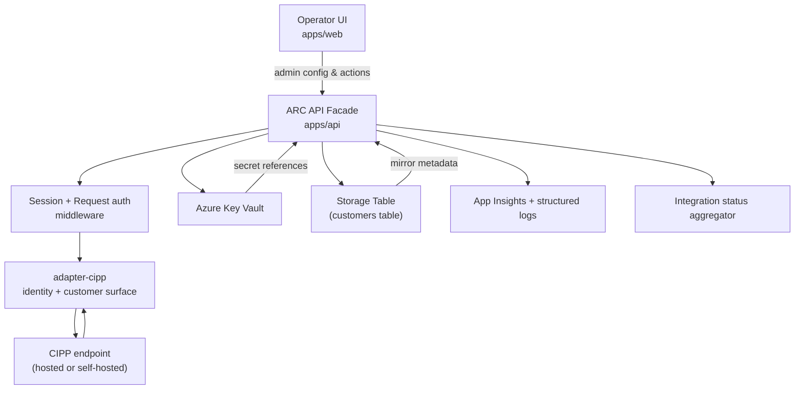
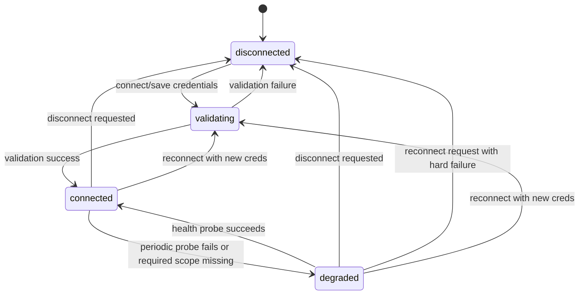
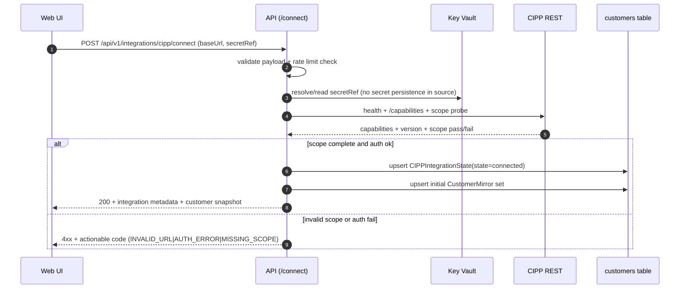
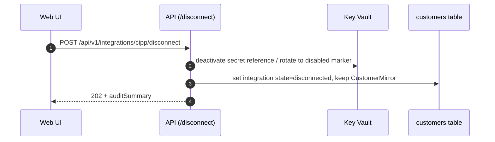

# GST-14 — Phase 1 Connect to CIPP Flow + Credential Lifecycle + Runbook

Date: 2026-05-28  
Status: CTO-locked technical execution plan  
Source: GST-4 and issue `GST-14`

## 1) Goals and non-goals

Goals:

- Enable operator connect flow against CIPP REST.
- Validate required CIPP API scope coverage before credentials are saved.
- Import CIPP customers into deterministic `CustomerMirror` metadata.
- Preserve mappings across disconnect/reconnect, including credential rotation.
- Expose one operational integration status (`connected`, `degraded`, `disconnected`) and one runbook.

Non-goals for GST-14:

- No automated scope expansion after initial connect.
- No full tenant-wide sync orchestration beyond deterministic customer import.
- No cross-environment secret replication automation.

## 2) System context and component diagram



Boundary map:

- Boundary A: Browser -> API (operator input, authz, CSRF, payload validation).
- Boundary B: API -> CIPP endpoint (network trust, mTLS/TLS enforcement, scope checks).
- Boundary C: Key Vault -> API runtime (secret material retrieval and rotation).

## 3) Data model (GST-14 minimum)

`CustomerMirror` (stored in `customers` table, deterministic partitioning)

- `partitionKey`: `tenantId`
- `rowKey`: `cippCustomerId`
- `tenantId`: partner tenant partition
- `cippCustomerId`: upstream identifier
- `displayName`: canonical display string
- `domainHint`: optional primary domain
- `sourceRevision`: hash from upstream payload
- `mappingVersion`: explicit monotonic integer
- `createdAt`: ISO timestamp
- `updatedAt`: ISO timestamp
- `status`: `active | stale | removed`
- `deletedAt`: optional tombstone for future soft delete

`CIPPIntegrationState` (stored in same table or companion partition)

- `partitionKey`: `integration`
- `rowKey`: `cipp-v1`
- `state`: `disconnected | validating | connected | degraded`
- `baseUrl`: sanitized base URL
- `secretRef`: Key Vault secret name/id reference
- `requiredScopes`: array
- `scopeVersion`: integer (increments on schema change)
- `lastCheckedAt`: ISO timestamp
- `lastFailureReason`: optional string code
- `customerSnapshotHash`: stable import hash for idempotence
- `healthRequestId`: latest probe id

## 4) State machine (integration lifecycle)



## 5) Canonical sequence diagrams

### 5.1 Fresh connect



### 5.2 Reconnect with credential rotation

```mermaid
sequenceDiagram
  autonumber
  participant UI as Web UI
  participant API as API (/reconnect)
  participant KV as Key Vault
  participant DB as customers table
  participant CIPP as CIPP REST

  UI->>API: POST /api/v1/integrations/cipp/reconnect (newSecretRef)
  API->>KV: read new secretRef
  API->>CIPP: validate auth + required scopes
  alt validation success
    API->>DB: update integration secretRef + state
    API->>DB: keep CustomerMirror rows; refresh metadata fields only
    API-->>UI: 207/200 no remap required
  else validation fail
    API-->>UI: 422 with explicit error and rollback plan
  end
```

### 5.3 Disconnect + preserved remap



## 6) Data-flow model (customer import)

```text
connect -> probe CIPP metadata -> normalize customer stream ->
  derive stable dedupe key (cippCustomerId + normalized name + sourceRevision) ->
  map to existing mirrors by stable key ->
  upsert table rows with deterministic ordering and immutable keys
```

Deterministic ordering rule:

- Sort upstream customers by `[displayName, cippCustomerId]`.
- Build rows with deterministic JSON serialization before hash calculation.
- Use `(partitionKey,rowKey)` keys directly from upstream IDs.

## 7) Failure modes and edge cases

- Empty base URL: reject with `INVALID_URL`.
- URL redirects to non-JSON: reject `BAD_UPSTREAM_RESPONSE`.
- Missing required scope: reject with `MISSING_SCOPE`, do not persist any secret ref.
- Secret read failure from Key Vault: reject `CREDENTIAL_READ_ERROR`; keep previous state untouched.
- Upstream timeout: retryable `CONNECTIVITY_ERROR`, keep prior state.
- Self-hosted cert chain mismatch: map to `CONNECTIVITY_ERROR` and include certificate hint.
- Schema drift in customer payload: store failure reason and emit `DEGRADED` when partial import possible.
- Partial customer import:
  - preserve previously valid mirror rows.
  - append `sourceRevision` diff metadata.
  - return 207 with per-item warning list.
- Reconnect with same payload during active connected state:
  - idempotent revalidation.
  - no duplicate mirror writes beyond hash change.

## 8) Security and trust boundaries

- Never write credential bytes into:
  - `localStorage`
  - query params
  - DB columns
  - logs or traces
- Use Key Vault references in config and short-lived cache with explicit TTL in API runtime.
- Redact upstream URLs? keep only sanitized base URL without tokens.
- Never log provider secrets; log `secretRef`, hash of url, `requestId`, `scopeCheck`.

## 9) API endpoints for GST-14 implementation

```text
POST   /api/v1/integrations/cipp/validate
POST   /api/v1/integrations/cipp/connect
POST   /api/v1/integrations/cipp/reconnect
POST   /api/v1/integrations/cipp/disconnect
GET    /api/v1/integrations/cipp/status
POST   /api/v1/integrations/cipp/customers/import
GET    /api/v1/integrations/cipp/customers
GET    /api/v1/health
```

## 10) Test coverage matrix (minimum complete)

### Unit and contract

- validation endpoint:
  - accepts valid URL + secret reference
  - rejects malformed URL
  - rejects missing scope with actionable code
  - never returns or stores raw secret
- customer import:
  - deterministic row key generation
  - duplicate import is idempotent
  - partial import returns 207 and warnings
- reconnect:
  - preserved customer map
  - updates secretRef only
- disconnect:
  - clears active secret binding
  - retains CustomerMirror rows
- status:
  - state transitions `connected -> degraded -> connected` and back

### Integration

- hosted mode and self-hosted mode share one response schema.
- connectivity failure does not degrade table persistence.
- scope drift is surfaced as `degraded` until operator reconnects.

### Security/negative

- API log assertions: no secret token or secret contents in log payload.
- Key Vault permission error fails safe (do not downgrade to cleartext config).
- URL injection and SSRF-safe host validation.

## 11) Work ownership and handoff

- Staff Engineer:
  - implement `adapter-cipp`, connect endpoints, integration state machine, customer import idempotency.
- QA Engineer:
  - build automated test matrix above plus manual runbook validation.
- Release Engineer:
  - provision secret reference naming and RBAC in Key Vault, add required App Settings for environment-specific URLs, update deployment docs.
- CTO review gate:
  - reject any implementation that persists secret material.
  - reject state transitions that drop existing mirror mappings.

## 12) Immediate open question

- Finalize required CIPP scope set with GST-4 auth spec before schema freeze.

## 13) Disposition

- Blocker: parent `GST-4` must approve final scope matrix and deployment mode defaults before implementation starts.
