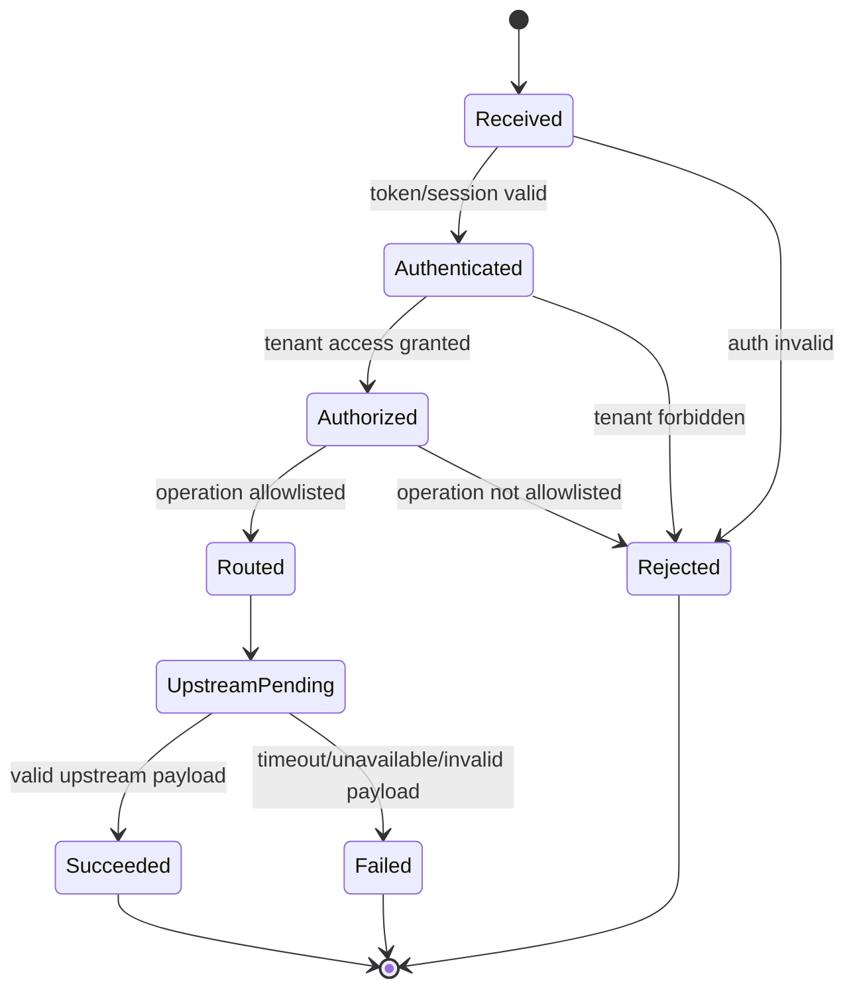
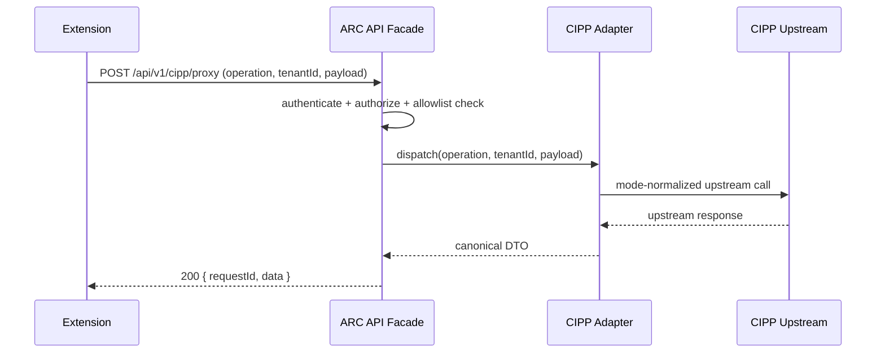

# GST-22 — Phase 0 CIPP REST API Surface + Hosted-vs-Self-Hosted Parity Spike

Status: Locked technical execution plan (CTO)
Issue: GST-22
Date: 2026-05-28

## 1) Decision Summary

This spike locks the minimal backend contract for the Google Extension to operate against CIPP, while keeping deployment mode (hosted ARC service vs customer self-hosted CIPP) as an implementation detail hidden behind a single API adapter.

Hard decisions:

- Extension talks only to an ARC-managed backend API surface.
- Backend adapter handles CIPP mode differences.
- API responses use stable extension-facing DTOs regardless of CIPP deployment mode.
- Parity is enforced with a mode matrix and contract tests run against both modes.

## 2) System Boundaries

Components:

- Browser extension UI (`apps/extension` target surface).
- ARC API facade (`apps/api` target surface; Azure Function in current infra direction).
- CIPP adapter (mode-aware: `hosted` | `self_hosted`).
- CIPP upstream APIs (customer-specific tenant context).

Trust boundaries:

- Boundary A: Browser -> ARC API (untrusted client input).
- Boundary B: ARC API -> CIPP endpoint (partner/customer network boundary).
- Boundary C: Secret store -> ARC API runtime (credential material).

Rules:

- No CIPP credentials in browser storage.
- Per-request authorization context must be derived server-side.
- All upstream calls must include request correlation IDs for incident debugging.

## 3) Phase 0 API Surface (Extension-facing)

Base: `/api/v1`

Endpoints:

- `GET /health`

  - Purpose: extension boot diagnostics.
  - Response: `{ "ok": true, "version": "<git-sha-or-tag>", "time": "ISO-8601" }`

- `GET /cipp/capabilities`

  - Purpose: discover mode-specific capabilities while preserving stable schema.
  - Response:
    - `mode`: `"hosted" | "self_hosted"`
    - `features`: `{ bulkActions: boolean, gdapAudit: boolean, licenseOps: boolean }`
    - `limits`: `{ rateLimitPerMinute: number | null, maxBatchSize: number | null }`

- `POST /cipp/proxy`
  - Purpose: controlled pass-through for approved operation IDs.
  - Request:
    - `{ operation: string, tenantId: string, payload: object }`
  - Response:
    - `{ requestId: string, data: object, warnings?: string[] }`

Operation policy:

- Only allowlisted `operation` values.
- Reject unknown operations with `422` and machine-readable code.
- Tenant access checked before dispatch.

## 4) Canonical Error Model

All non-2xx responses:

- `{ error: { code: string, message: string, retryable: boolean, details?: object }, requestId: string }`

Initial error codes:

- `AUTH_REQUIRED` -> `401`
- `FORBIDDEN_TENANT` -> `403`
- `UNSUPPORTED_OPERATION` -> `422`
- `UPSTREAM_TIMEOUT` -> `504`
- `UPSTREAM_UNAVAILABLE` -> `503`
- `BAD_UPSTREAM_RESPONSE` -> `502`
- `RATE_LIMITED` -> `429`

## 5) State Model (Request Lifecycle)

## 6) Sequence (Happy Path)

## 7) Hosted vs Self-hosted Parity Matrix

| Concern                | Hosted                    | Self-hosted                                       | Contract stance                                    |
| ---------------------- | ------------------------- | ------------------------------------------------- | -------------------------------------------------- |
| Auth material location | ARC managed secret store  | customer-provided endpoint + credential reference | hidden from extension                              |
| Network reachability   | fixed ARC infra           | variable customer infra                           | normalize failures to error model                  |
| API version drift      | centrally controlled      | customer-upgraded independently                   | negotiate via `/cipp/capabilities` + adapter shims |
| Rate limits            | predictable shared policy | unknown/custom                                    | expose in `limits`; enforce local guardrails       |
| Feature availability   | mostly uniform            | may be missing modules                            | reflect in `features`, never schema-break          |

Non-negotiable parity rule:

- Extension DTO shape is stable across modes; differences appear only as values/flags, not missing top-level fields.

## 8) Failure Modes and Edge Cases

- Stale tenant mapping:
  - Detect at authorize step; return `FORBIDDEN_TENANT`.
- Self-hosted endpoint TLS misconfiguration:
  - Map to `UPSTREAM_UNAVAILABLE`, include `details.reason=tls_error`.
- Upstream schema drift:
  - Adapter validation failure -> `BAD_UPSTREAM_RESPONSE`.
- Partial batch operation failures:
  - Return `200` with `warnings[]` + per-item status in `data`.
- Upstream timeout:
  - Hard timeout in adapter; return `UPSTREAM_TIMEOUT`, `retryable=true`.

## 9) Test Coverage Matrix (Phase 0)

Contract tests (must run in both modes):

- `GET /health` schema and liveness fields.
- `GET /cipp/capabilities` always includes `mode`, `features`, `limits` keys.
- `POST /cipp/proxy` rejects unknown operation with `422/UNSUPPORTED_OPERATION`.
- Error model presence and `requestId` propagation on all failures.

Authorization tests:

- unauthorized request -> `401/AUTH_REQUIRED`.
- cross-tenant access attempt -> `403/FORBIDDEN_TENANT`.

Resilience tests:

- simulated timeout -> `504/UPSTREAM_TIMEOUT`.
- simulated 5xx upstream outage -> `503/UPSTREAM_UNAVAILABLE`.
- malformed upstream payload -> `502/BAD_UPSTREAM_RESPONSE`.

Parity tests:

- same operation in hosted and self-hosted returns same top-level schema.
- capability flags differ by values only (no key removals).

## 10) Implementation Work Breakdown

1. Build API facade skeleton with `/health`, `/cipp/capabilities`, `/cipp/proxy`.
2. Implement operation allowlist and canonical error middleware.
3. Implement mode-aware CIPP adapter with shared DTO normalization.
4. Add contract/parity test suites with hosted + self-hosted fixtures.
5. Wire structured logs (`requestId`, `tenantId`, `operation`, `mode`, `latencyMs`, `outcome`).

## 11) Hand-off

Execution ownership:

- Staff Engineer: implement items 1-3.
- QA Engineer: build matrix coverage for item 4.
- Release Engineer: runtime config and secret-path validation for both modes.

Review routing:

- Once implementation branch is ready, route PR to Staff Engineer for technical review, then QA Engineer for acceptance verification per matrix above.

## 12) Evidence-based parity finding (2026-05-28)

This issue's gating check is satisfied for current `adapter-cipp` scope.

Required adapter operations and parity status:

- `listCustomers` -> CIPP `GET /ListTenants`: `full`
- `listUsers` -> CIPP `GET /ListUsers`: `full`
- `getUser` -> CIPP `GET /ListUsers` with `UserID`: `full`
- `suspendUser` -> CIPP `GET /ExecDisableUser` with `Enable=false`: `full`
- `resumeUser` -> CIPP `GET /ExecDisableUser` with `Enable=true`: `full`

Webhook parity status:

- `PublicWebhooks` exists but hosted-vs-self-hosted event-level behavior remains `partial` (not a v0.1 blocker for the current adapter contract).

Go/no-go statement:

- **GO** for Option B v0.1 on read + suspend/resume scope.
- **Constrain** webhook-driven behavior to later phase acceptance criteria until hosted event parity is validated with live hosted tenant evidence.
