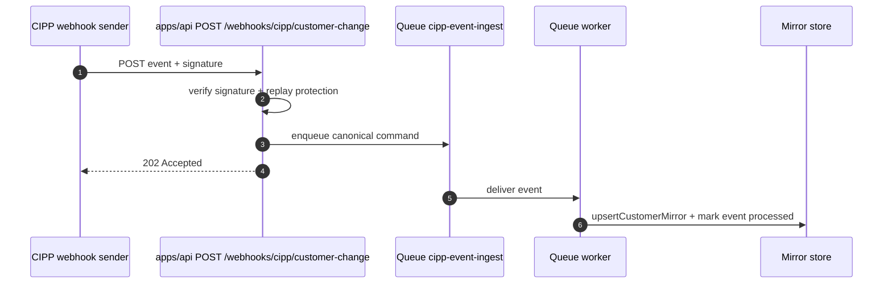
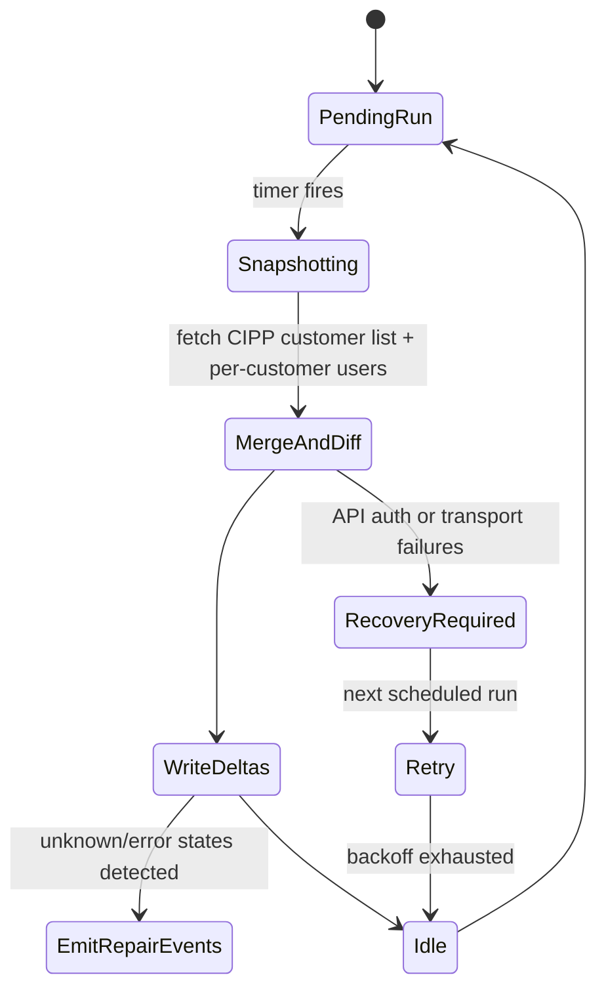
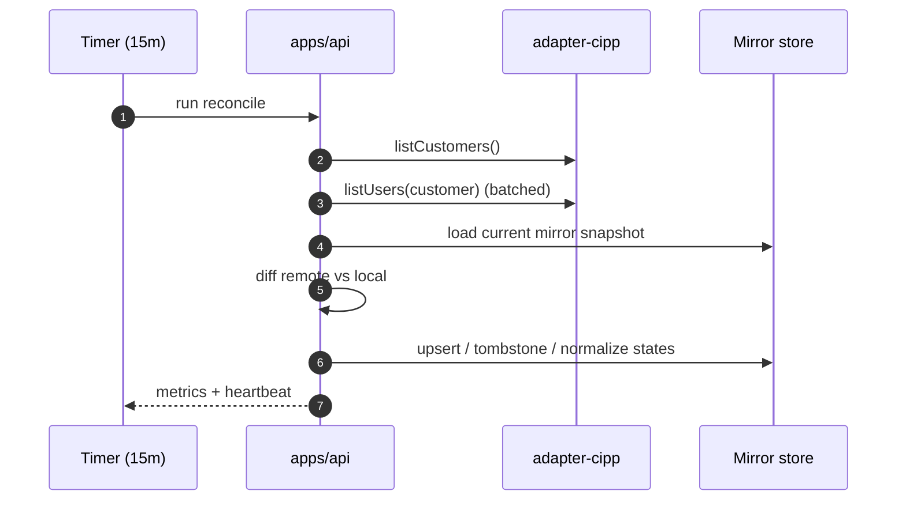

# GST-23 — Phase 1: `adapter-cipp` read + webhook ingest + reconciliation loop

Status: Blocked until branch/worktree is switched to GST-23 implementation base.
Source: Parent plan `GST-4`

## Implementation target (locked 2026-05-28)

- Branch: `origin/gst-23-implementation-target`
- Target commit: `00f493ead66496e85e48ae553ae3243cf3fe07f6`
- Intent: this branch/commit is the canonical GST-23 implementation and review target.

## 1) Objective and guardrail

Build customer-mirror ingestion from CIPP with two independent data paths:

- Polling REST reads for canonical correctness.
- Webhook event ingress for near-real-time convergence.

The reconciliation loop is the source of truth for durability and recovery.

Primary compatibility rule:
- All read/list results are surfaced through `IdentityProvider`-compatible result types and shared typed errors from `packages/core`.

## 2) Hard blocker (unblock required before code changes)

- Current checkout is on `chore/gst-18-branch-protection` (checked from `.git/HEAD`).
- GST-23 work must be executed against `origin/gst-23-implementation-target` at `00f493ead66496e85e48ae553ae3243cf3fe07f6`, not on GST-18 branch-protection scope.
- Unblock action: maintainer must switch this worktree to the GST-23 target branch/commit before implementation updates are landed.

## 3) Architecture and component boundaries

```mermaid
flowchart TD
  CIPP[CIPP API (hosted/self-hosted)]
  Adapter[packages/adapter-cipp
CIPP REST + webhook verifier]
  API[apps/api Azure Functions]
  Queue[Queue: cipp-event-ingest]
  Mirror[CustomerMirror store]
  Reconcile[15-minute timer trigger]
  Core[packages/core typed contracts]

  API --> Core
  API --> Adapter
  Adapter --> CIPP
  CIPP -->|webhooks| API
  API -->|enqueue| Queue
  Queue --> API
  API -->|upsert| Mirror
  Reconcile -->|re-list drift repair| API
  Reconcile -->|compare + upsert| Mirror
```

Trust boundaries:
- Browser -> API: untrusted user input and request headers.
- API -> CIPP: partner/customer network boundary; auth and signatures validated here.
- Mirror write path: durable persistence boundary where idempotency/replay decisions are finalized.

## 4) Data contracts (phase 1)

`CustomerMirror` (new `packages/core` model):

- `customerId` (stable tenant/customer key)
- `displayName`
- `bindingState` = `bound | unbound | unknown`
- `cippTenantId` (source-of-truth from CIPP)
- `cippSource` = `hosted | self_hosted`
- `sourceVersion` (optional monotonic sequence/hash)
- `lastObservedAt` (UTC ISO)
- `lastWebhookAt`
- `reconcileCursor` (last sync watermark)
- `etag` or `fingerprint` for drift detection
- `lastError` { `code`, `message`, `retryAfterAt`? }

Webhook event dedupe state:

- `eventId`
- `provider` = `cipp`
- `tenantId`/`customerId`
- `type` (customer created/updated/deleted/user lifecycle)
- `payloadHash`
- `receivedAt`
- `processedAt`
- `status` = `accepted | duplicate | stale | failed`

## 5) CIPP adapter contract in `packages/adapter-cipp`

Provide typed implementations for:

- `listCustomers(): Promise<ProviderResult<readonly Customer[]>>`
- `listUsers(customer): Promise<ProviderResult<readonly User[]>>`
- `getUser(customer, key): Promise<ProviderResult<User>>`
- `readUserSnapshot(customer, key): Promise<ProviderResult<AuditEntry>>`
- `suspendUser`/`resumeUser` if not already implemented in-phase

Error compatibility:
- Use existing `ProviderError` hierarchy from `packages/core`.
- Add new codes only if required, and preserve current ones: `generic`, `not_found`, `quota_exceeded`, `network_timeout`, `expired_refresh_token`.
- Keep all HTTP translation in API layer to canonical action-envelope statuses used by Phase-1 API.

## 6) Webhook ingest path

Endpoint:
- `POST /api/v1/webhooks/cipp/customer-change`

Verification pipeline:
- Read signature from header.
- Resolve secret by tenant/customer binding.
- Verify HMAC (constant-time compare).
- Parse event envelope and require mandatory fields.
- Enforce replay window with event timestamp + skew tolerance.

Idempotency strategy:
- Persist `{ eventId, payloadHash, customerId }` with TTL.
- If same `eventId` already seen and same hash => `409`/`200` (already processed).
- If same `eventId` different payload => `409` + `webhook_replay_conflict`.
- If `eventTime` older than persisted watermark => mark `stale` and ignore.

Processing:
- Decode event to canonical `CustomerChangeCommand`.
- Push payload to queue (`cipp-event-ingest`) with correlation context.
- Worker dequeues and applies upsert (`upsertCustomerMirror`, soft-delete semantics where supported).
- Store replay metadata atomically with mirror update to make writes idempotent end-to-end.



## 7) Reconciliation loop

Schedule:
- `ReconcileCustomers` timer trigger every `15m`.

State transition:


Algorithm:
- Pull current remote customer snapshot via adapter `listCustomers` (and possibly `listUsers` for fingerprinting).
- Compare with mirror by `customerId`.
- For each diff:
  - missing mirror + present remote => insert mirror row.
  - missing remote + stale mirror + `state=inactive` => mark `unbound`.
  - field drift => upsert changed fields.
- Persist `reconcileCursor` and run stats.
- Emit internal repair event only when a webhook is missing and drift exceeds threshold.



## 8) Failure modes and explicit edge cases

1. Duplicate webhook deliveries: event persisted in replay table, mirror write is idempotent.
2. Out-of-order webhook arrivals: compare event timestamp/watermark before apply.
3. Replay storm: bounded queue and queue visibility timeout + dead-letter after max retries.
4. Signature mismatch: reject with non-2xx, increment `webhook_signature_error` metric.
5. Stale tenant secret: if verification key missing, return `422` and enqueue to alert queue for ops.
6. Webhook payload without tenant mapping: quarantine + 400 with structured error code.
7. Drift > window: reconciliation run emits discrepancy metric and heals mirror via REST read.
8. CIPP mode variance (hosted/self-hosted): adapter normalizes missing fields and annotates warning flags in `lastError`.

## 9) Test matrix (minimal required for GST-23)

Contract/unit tests:
- `packages/adapter-cipp`: smoke with representative fixtures from `docs/cipp-api-surface.md`.
- IdentityProvider contract suite reuse: `runIdentityProviderContractSuite` against CIPP adapter when endpoint mapping is available.

API tests:
- webhook success + missing signature + malformed signature + duplicate id + stale timestamp.
- idempotency and replay key behavior when same event repeats with same/different payload.
- queue worker out-of-order event simulation.
- reconcile loop: missed event replay heals mirror state.

End-to-end tests:
- inject one webhook, assert single mirror row write.
- inject duplicate webhook, assert no duplicate writes.
- skip webhook then run reconcile and verify recovery.
- simulate one-sided webhook delivery gap and verify drift patch by timer path.

## 10) Deliverables mapped to GST-23 objective

- REST read/list + typed errors: `packages/adapter-cipp` implemented against `IdentityProvider` and parity fixtures.
- Webhook receiver: `apps/api` signed webhook endpoint with idempotency + replay control.
- Async sync path: queue + worker in `apps/api`.
- Reconciliation job: 15-minute timer function in `apps/api`.
- Acceptance evidence: docs and integration tests linked to `docs/cipp-api-surface.md`.

## 11) Proposed execution ownership and review path

- Staff Engineer: implementation of adapter-cipp, webhook endpoint, queue worker, reconcile timer, and tests.
- QA Engineer: test matrix execution and fixture coverage.
- Release Engineer: storage/table/queue secret provisioning and app setting hardening.
- CTO review gate: no branch handoff until idempotency and reconciliation healing are proven by tests.
