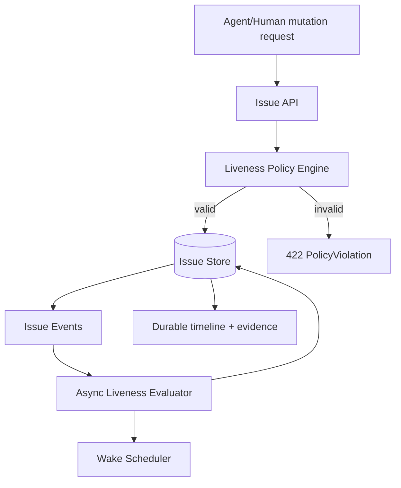
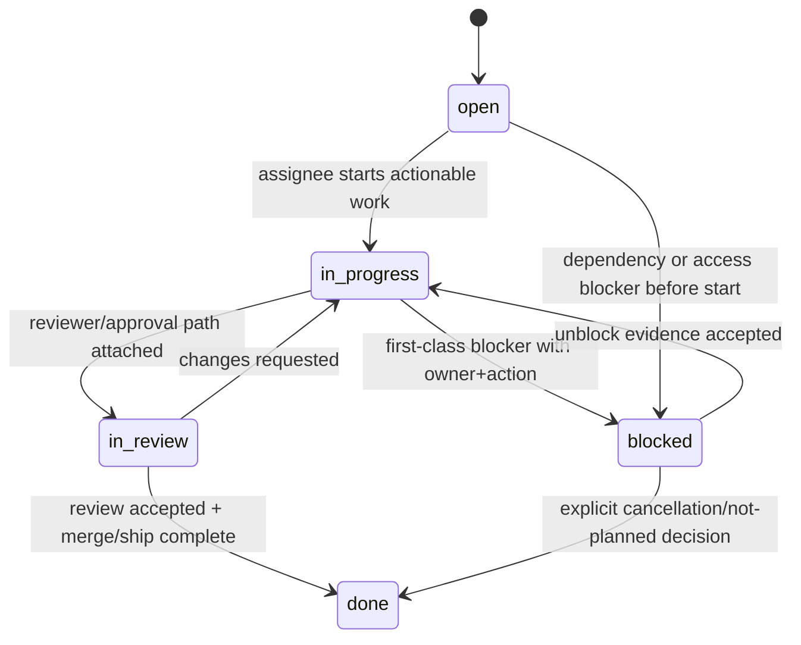
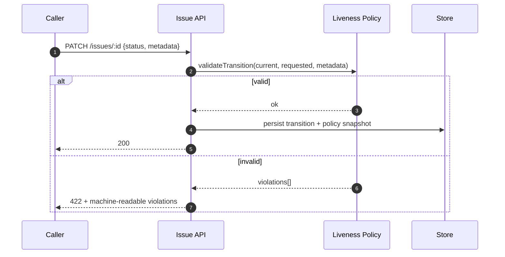

# GST-119 — CTO Lock: Permanent Liveness Guardrails for GST Execution

Date: 2026-05-29  
Issue: `GST-119`  
Mode: Eng manager / technical lock

## Acknowledgement and scope

No new thread comment is pending in this wake. The work item is actionable as an assigned critical issue, so this heartbeat locks the permanent execution guardrail design and hands implementation to engineering roles.

## 1) Problem and decision

Problem to solve:
- GST execution can stall, loop, or stay incorrectly `in_progress` without a real continuation path.
- Status transitions are inconsistently enforced across issue updates, comments, and handoff flows.
- Blocked and review states are sometimes used without first-class owner/action evidence.

Locked decision:
- Introduce a **single server-side liveness policy engine** that validates every issue lifecycle mutation before persistence.
- Add a **continuation-path contract** so `in_progress` is only legal when a live, machine-checkable wake path exists.
- Add **blocked contract enforcement** so blocked state requires named unblock owner + concrete action.
- Add **in_review contract enforcement** so review state requires a real reviewer/approval/interaction/monitor path.
- Add **done contract enforcement** to prevent close-without-artifact or close-with-open-child inconsistencies.

## 2) Architecture and boundaries

Boundaries:
- `Issue API` remains command surface only.
- `Liveness Policy Engine` is sole owner of transition legality.
- `Async Liveness Evaluator` only diagnoses and proposes transitions; it cannot bypass policy checks.

## 3) Lifecycle state machine

Guardrail rules:
- `in_progress` requires `continuation_path.kind` in `{wake_assignee, pending_interaction, running_child_issue}`.
- `blocked` requires `blocker.owner`, `blocker.action`, and `blocker.scope`.
- `in_review` requires `review_path.kind` in `{requested_reviewer, pending_confirmation, monitor_gate}` and resolvable target id.
- `done` requires terminal evidence and zero unresolved required children.

## 4) Data model changes (minimal, explicit)

Add to issue transition payload contract:
- `transitionIntent`: `start | request_review | close | block | unblock | reroute`
- `continuationPath`:
  - `kind`: `wake_assignee | pending_interaction | running_child_issue | none`
  - `targetId`: issue/interaction/reviewer id
  - `expiresAt`: optional ISO timestamp
- `blocker`:
  - `ownerAgentId | ownerUserId`
  - `actionRequired`
  - `unblockCondition`
- `reviewPath`:
  - `kind`: `requested_reviewer | pending_confirmation | monitor_gate`
  - `target`
- `evidenceRefs`: array of durable artifacts (`commentId`, `docPath`, `prNumber`, `runId`)

## 5) Transition validation sequence

## 6) Failure modes and behavior

- Missing continuation path on `in_progress`:
  - reject with `POLICY_CONTINUATION_REQUIRED`.
- `blocked` without named owner/action:
  - reject with `POLICY_BLOCKER_INCOMPLETE`.
- `in_review` with no review target:
  - reject with `POLICY_REVIEW_PATH_REQUIRED`.
- `done` with unresolved required child issue:
  - reject with `POLICY_CHILDREN_UNRESOLVED`.
- Legacy calls that lack new metadata:
  - migrate via compatibility shim for one release window, emit warnings, then enforce hard-fail.

## 7) Test matrix (must pass before rollout)

### Unit
- Transition validator allows all legal edges and rejects illegal edges.
- Each policy violation code is deterministic and stable.
- Compatibility shim maps legacy payloads correctly.

### Integration
- API rejects invalid transitions with structured errors.
- Accepted transitions persist policy snapshot and evidence refs.
- Re-entrant updates remain idempotent with same idempotency key.

### Concurrency
- Two concurrent status writes cannot bypass policy (optimistic lock + retry).
- Stale client update gets conflict or policy re-evaluation.

### Regression / E2E
- Assigned issue can move to `in_progress` only with live continuation metadata.
- Review workflow cannot mark `in_review` without reviewer/interaction.
- Block/unblock loop requires owner/action throughout.
- Done path rejects while required child remains open.

## 8) Rollout plan

1. Introduce policy engine in shadow mode (`log-only`) for one release.
2. Emit policy violation telemetry, classify top offenders.
3. Enable hard enforcement for `blocked` and `in_review` first.
4. Enable hard enforcement for `in_progress` continuation contract.
5. Enable `done` unresolved-child enforcement.

Rollback:
- Feature flag `liveness_policy_enforcement` can revert to shadow mode.
- No schema rollback required if additive fields are nullable.

## 9) Implementation handoff

Create/assign child issues:
- Staff Engineer: implement policy engine + validator + API contract updates.
- Release Engineer: rollout flags, telemetry dashboard, staged enablement.
- QA Engineer: policy E2E matrix + concurrency regression suite.

Acceptance criteria for GST-119 completion:
- All transition writes are policy-gated.
- Hard-fail enforcement active for `in_progress`, `blocked`, `in_review`, `done` contracts.
- Telemetry dashboard shows zero unknown transition bypasses for 48h.
- QA sign-off attached with failing/negative case evidence.

## 10) Disposition

Recommended issue state after this heartbeat: `in_progress` only if implementation child issues are created immediately in the same thread; otherwise `blocked` on assignment orchestration owner.

Given this heartbeat produced the locked technical plan artifact but did not create child issues from inside the issue thread, operational next step is:
- assign child issue creation to issue assignee action in-thread, then keep `GST-119` in `in_progress` with `running_child_issue` continuation metadata.
