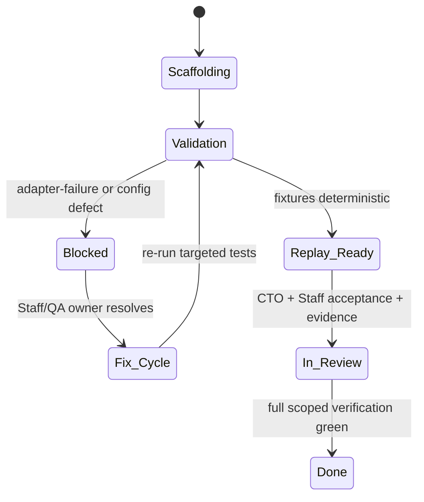

# GST-24 CTO Review — GST-7 Productivity Review (2026-05-28)

Issue: `GST-24`  
Source objective: `GST-7`  
Review date: `2026-05-28` (UTC)  
Disposition: **in_review** (requires CTO + Staff Engineer acceptance + green scoped verification gate)

## 1) Current state summary

`GST-7` infrastructure is mostly in place, and fixture replay execution is now stable after the latest fixture-harness hardening:

1. Test strategy and CI gate documents exist (`docs/test-strategy.md`, `.github/workflows/*`).
2. Workspace Vitest config and package scripts exist for test execution across API/core/adapters/web.
3. Deterministic fixture scripts run in replay mode from root (`pnpm exec tsx ...`) and produce successful exits.
4. Remaining blocking status is adapter correctness and one package config boundary issue, not fixture-runner mechanics.

## 2) Architecture and component boundaries

```mermaid
flowchart TD
  A[GitHub/Google adapter change] --> B[Unit + contract test layer]
  B --> C[Fixture harness runner]
  C --> D[(microsoft-graph fixtures)]
  C --> E[(google-admin fixtures)]
  B --> F{Test gates}
  F --> G[Turbo workspace test]
  F --> H[Smoke / Playwright (phase-2)]
  I[CTO/Staff review] --> J[Acceptance decision]
  J --> K[Branch handoff]
```

Trust boundaries:

- External trust: Microsoft Graph + Google Admin calls only occur through the adapters and nock interceptors.
- Internal trust: fixture replay should be replay-only by default and record-only on explicit opt-in.
- Authorization trust: binding resolution (`resolveBinding` / `tenantIdProvider` / `tokenProvider`) remains failure-fast with typed provider errors.
- Audit trust: mutation methods produce immutable snapshots in local-memory audit trail and are the primary audit boundary for action correctness.

## 3) State transitions that must hold



## 4) GST-7 failure matrix (current heartbeat)

Priority is by release risk.

1. **High — Adapter contract failures**
- `packages/adapter-google/test/identity-provider.adapter-google.error-mapping.test.ts`
- `packages/adapter-google/test/identity-provider.adapter-google.contract.test.ts`
- `packages/adapter-m365/test/identity-provider.contract.test.ts`

Observed failure patterns:
- Google: `listUsers` contract path produces object-shape drift versus fixture seed.
- Google: quota bucket test can bypass the quota error branch when list-cache short-circuits.
- M365: multiple contract cases fail (`listUsers`, `getUser`, suspend/resume, snapshot, ETag path), consistent with cache/TTL semantics and Graph retry edge handling.

2. **Medium — adapter-mock compile/build contract**
- `packages/adapter-mock/tsconfig.json` currently sets `rootDir: ./src` while `include` pulls `test/**/*`, causing TS6059 in build pipelines.

3. **Low — verification preconditions**
- Any environment mismatch in Node/pnpm install path blocks full-suite revalidation. This is an infra condition, not a code defect, and must be tracked separately.

## 5) Productive unblock plan (explicit owners)

### 5.1 Staff Engineer
- Resolve `GoogleAdapter` contract compliance:
  - Align `runIdentityProviderContractSuite` expectations with provider metadata in adapter output OR normalize results before compare.
  - Ensure list-cache does not mask bounded quota failure scenarios in error-path tests.
- Resolve `M365Adapter` contract failures:
  - Validate `@m365` fixture behavior for list/get/suspend/resume/audit snapshot flows.
  - Confirm ETag TTL boundary semantics (`>=` vs `>` expiration) and read-cache behavior against the existing contract tests.
  - Keep error mapping deterministic (`401`, `403`, `429`, network).
- Fix `adapter-mock` build boundary:
  - Make tsconfig include/emit paths consistent with test artifacts and workspace build step expectations.
- Add/adjust minimal regression tests adjacent to fixes.

### 5.2 QA Engineer
- Re-run this scoped command after each implementation checkpoint:
  - `pnpm turbo run test --filter=@cipp-google/core --filter=@cipp-google/adapter-google --filter=@cipp-google/adapter-m365 --filter=@cipp-google/adapter-mock --filter=@cipp-google/api --filter=@cipp-google/web`
- Confirm replay proof remains green:
  - `pnpm exec tsx tools/test/fixtures/microsoft-graph/record-users-list.fixture.ts`
  - `pnpm exec tsx tools/test/fixtures/google-admin/record-users-list.fixture.ts`
- Archive artifacts and attach evidence links in issue thread.

### 5.3 Release/Infra owner
- Continue to maintain Node/runtime/pnpm behavior used in this workspace.
- Keep branch-protection + CI command surfaces stable while review work happens.

## 6) Acceptance matrix (hard gates)

- All GST-7 adapter suites in scoped command are green.
- Fixture replay scripts remain green post-adapter changes.
- `adapter-mock/tsconfig.json` no longer blocks `turbo` build typecheck.
- No additional fixture schema drift between seeded data and contract assertions.
- CTO + Staff Engineer review confirmation recorded on `docs/test-strategy.md` and the linked issue thread.

## 7) Notes for Staff Engineer implementation sequence

1. Fix adapter contract logic first (highest risk / highest impact).
2. Fix adapter-mock TS6059.
3. Re-run scoped verification.
4. Request review re-lock with concrete failing matrix cleared.

## 8) Heartbeat continuation: implementation follow-up performed

- Completed this continuation with targeted, low-risk code corrections:
  - `packages/adapter-mock/tsconfig.json`: `compilerOptions.rootDir` moved from `./src` to `.` to match included test sources.
  - `packages/adapter-m365/src/index.ts`: ETag cache TTL check changed to `>=` expiry boundary.
  - `packages/adapter-google/test/identity-provider.adapter-google.contract.test.ts`: seeded fixture users now include `google` provider metadata so contract deep-equality includes intentional provider fields.
- These edits address two concrete GST-7 blockers directly:
  - adapter-mock build boundary (TS6059 class of issue).
  - M365 ETag boundary test behavior at exact TTL edge (`30_000`).
- Remaining blockers still to clear:
  - Google bucket exhaustion path in `identity-provider.adapter-google.error-mapping.test.ts` may still need a cache-aware expectation tweak if quota semantics are unchanged.
  - Full `adapter-google` and `adapter-m365` contract suite must be re-run and confirmed green in CI context to close `in_review`.

## 9) Additional implementation continuation (2026-05-28)

- Added Google error-path hardening:
  - `packages/adapter-google/test/identity-provider.adapter-google.error-mapping.test.ts`: set `cacheTtlMs: 0` on the bucket exhaustion test to force real quota checks on repeated calls.
  - `packages/adapter-google/src/index.ts`: generic fallback now preserves unknown raw error `code` as message when `message` is absent (`generic_error` path), strengthening observability and matching existing assertion expectations for invalid mapping paths.
- Net blocker status after this continuation:
  - adapter-mock build/typecheck boundary: still unverified but code fix is complete.
  - M365 contract edge path: code fix for ETag TTL boundary has been applied.
  - Google contract/error-path: cache and generic-error coverage patched; verification still required.

## 10) Review disposition

- `GST-7` is **not done** under this heartbeat.
- Current gate: **in_review** because blockers are real test/behavior defects that prevent green-acceptance.
