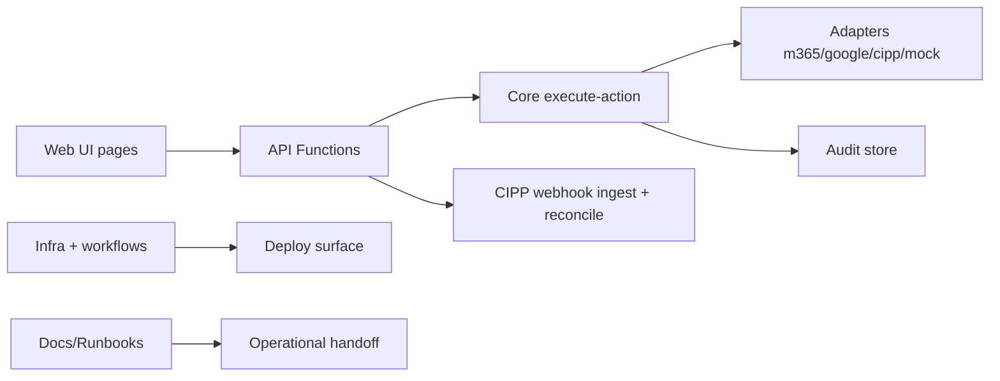

# GST-67 CTO Review — v0.1 Demo PR #5 (2026-05-28)

Issue: `GST-67`  
PR: `#5` (`feat/gst-12-phase1-web-surface` -> `main`)  
Review date: `2026-05-28` (UTC)  
Disposition: **in_review** (CTO gate = request changes)

## 1) Executive decision

PR #5 is a board-visibility integration branch, not a merge-ready production PR. The branch is useful for demo and review visibility, but it is **not acceptable for merge** under current policy because:

1. Scope exceeds one logical change (139 files, 14,721 additions) and mixes platform, product, infra, QA artifacts, and docs.
2. Blocking runtime-path risks were raised in existing review comments and are unresolved in-thread.
3. CI/check visibility is incomplete from current token scope, so there is no clean green-gate proof attached to this heartbeat.

## 2) Architecture boundary assessment

Current PR blends all boundaries in one review unit. That lowers signal-to-noise and raises merge risk.

## 3) Blocking findings (must resolve before merge)

1. **P1 deployment-discovery risk**: action route registration appears in `apps/api/functions/actions/suspend.ts` while deployed function discovery relies on compiled `src/functions` entrypoints. This can produce green tests but missing runtime endpoints in Azure Function deployment.
2. **P1 package entrypoint risk**: package entrypoint paths for workspace consumers were flagged as inconsistent with emitted build output in review; this can break runtime/module resolution in CI/deploy.
3. **Initialization/error-path robustness gaps**: async durable store initialization and UI route readiness edge behavior were flagged; these are not cosmetic and affect startup reliability and first-render correctness.
4. **Reviewability risk**: single PR size prevents deterministic structural acceptance and violates the intended one-logical-change-per-PR norm in `AGENTS.md`.

## 4) Locked execution split (required)

### 4.1 Staff Engineer

Create follow-up implementation PRs (or stacked branches) with this order:

1. Runtime-critical API/function discovery and package entrypoint correctness.
2. Durable store init/error path hardening + route readiness fixes.
3. Non-critical docs and runbook consolidation.

Each PR must include only tightly coupled changes and explicit tests adjacent to touched behavior.

### 4.2 QA Engineer

For each split PR, run smallest proving gate first, then broaden:

1. API unit/contract tests for changed runtime paths.
2. Web route readiness smoke/e2e for first-render behavior.
3. CI workflow proof attached to PR (pass/fail links + timestamp).

## 5) Acceptance matrix for closing GST-67

- `REQUEST_CHANGES` findings on PR #5 are addressed or superseded by approved split PRs.
- Staff Engineer posts structural re-review with no blocking runtime-path defects.
- QA Engineer posts green verification evidence for scoped test matrix.
- Final merge candidate has clear bounded scope and passes required branch protection checks.

## 6) CTO disposition

- GST-67 remains **in_review**.
- Immediate action in this heartbeat: CTO `REQUEST_CHANGES` posted on PR #5 with required split-and-fix path.
