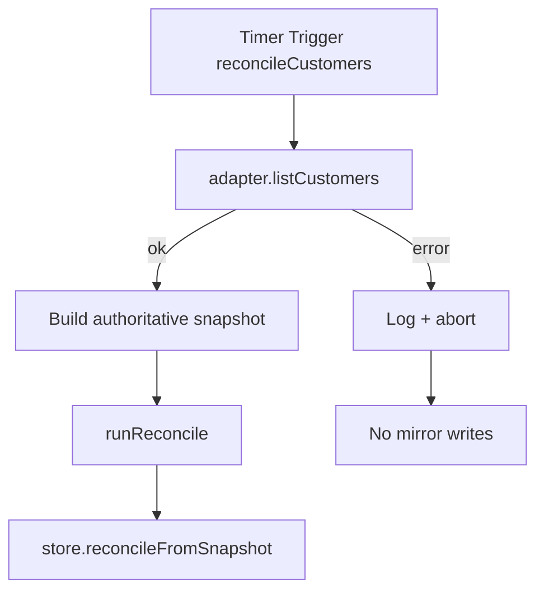
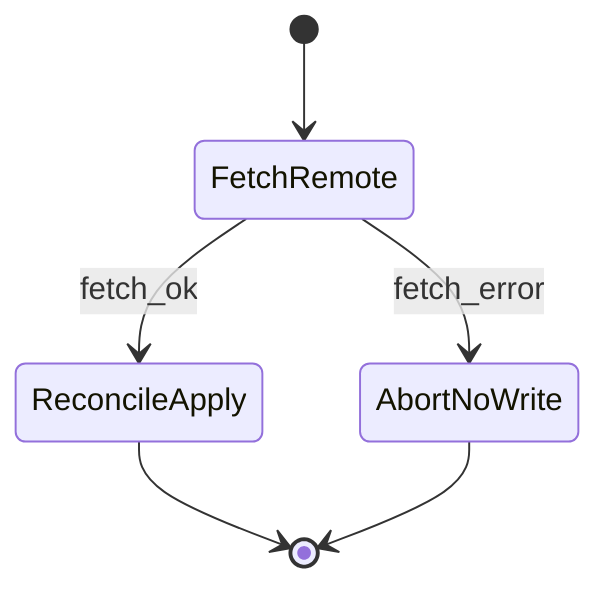
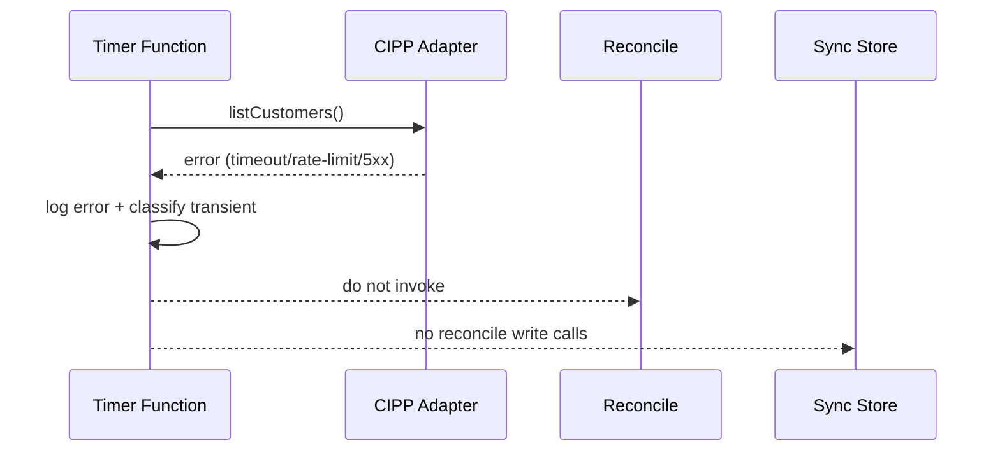

# GST-89 CTO Lock — Reconcile Fail-Closed + Durable Store Policy (2026-05-28)

Issue: `GST-89`  
Source branch reviewed: `chore/gst-18-branch-protection`  
Review date: `2026-05-28` (UTC)

## Decision

Status for GST-89 at this heartbeat: **blocked** (release gate remains closed).

Two runtime-critical safety defects remain and must be fixed before Release Engineer handoff:
- `apps/api/src/functions/reconcileCustomers.ts` currently converts upstream read failure into an empty snapshot, which drives full local unbind in reconcile.
- `apps/api/src/cipp/store.ts` currently allows silent fallback from durable storage to in-memory when durable setup fails.

## Locked architecture decisions

### 1) Reconcile must fail closed on upstream snapshot errors

Hard rule:
- If `adapter.listCustomers()` fails, `reconcileCustomers` must abort reconcile and perform **zero mirror mutation writes**.

Allowed behavior:
- Emit structured error log with failure reason.
- Return cleanly (timer function completes without destructive reconcile).

Disallowed behavior:
- Returning `[]` for a failed fetch.
- Inferring authoritative empty remote set from transport/runtime error.

### 2) Authoritative-empty and failed-fetch are different states

Hard rule:
- Only an explicitly successful snapshot fetch may carry `[]` as authoritative "no customers" input.

Required type boundary:
- Replace implicit `CustomerMirrorRecord[]` fetch contract with a result shape that distinguishes:
  - `ok: true, snapshot: CustomerMirrorRecord[]`
  - `ok: false, error: ...`

`runReconcile` may only call `reconcileFromSnapshot` when `ok: true`.

### 3) Durable store fallback policy must be explicit by environment

Hard rule:
- In production-like runtime, if a durable store is configured but cannot be initialized, startup must fail fast.

Allowed fallback:
- In-memory fallback only when a dedicated explicit opt-in is set (dev/test only), e.g. `CIPP_ALLOW_INMEMORY_FALLBACK=true`.

Disallowed behavior:
- Catch-all fallback to in-memory without operator intent.

## Data-flow diagram

## State-transition guardrails

## Failure-mode sequence (must be preserved)

## Required test matrix (blocking)

1. Reconcile failure-mode regression (`apps/api/test/cipp-sync.test.ts` or adjacent reconcile test file):
- Setup: local mirror contains bound customer.
- Inject: `listCustomers()` failure.
- Assert: reconcile reports failure/abort path and local row remains `bound`.

2. Authoritative-empty success path regression:
- Setup: local mirror contains bound customer.
- Inject: successful `listCustomers()` returning empty set.
- Assert: row transitions to `unbound`.

3. Durable store strictness test (`apps/api/src/cipp/store.ts` tests):
- Setup: durable storage env configured but constructor/init throws.
- Assert in production-like env: `createCippSyncStore()` throws (or returns typed startup error) and does not return `InMemoryCippSyncStore`.

4. Dev/test fallback test:
- Setup: same failure, plus explicit opt-in fallback flag.
- Assert: in-memory store is used only under opt-in condition.

## Ownership handoff

- **Staff Engineer (owner):** implement the two guardrails and the four regressions above.
- **Staff Engineer (verification):** run targeted tests only for touched runtime surfaces and attach command output snippets in issue thread.
- **CTO (next gate):** rerun structural pre-landing review after evidence is posted.
- **Release Engineer:** blocked until CTO gate reopens.

## Exit criteria for unblock

GST-89 can move from **blocked** to **in_review** only when:
1. No path exists from upstream fetch failure to `reconcileFromSnapshot([])`.
2. No silent durable-to-in-memory fallback exists in production-like env.
3. Regression tests for both failure classes are green and attached.
