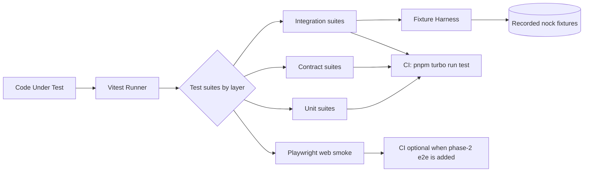
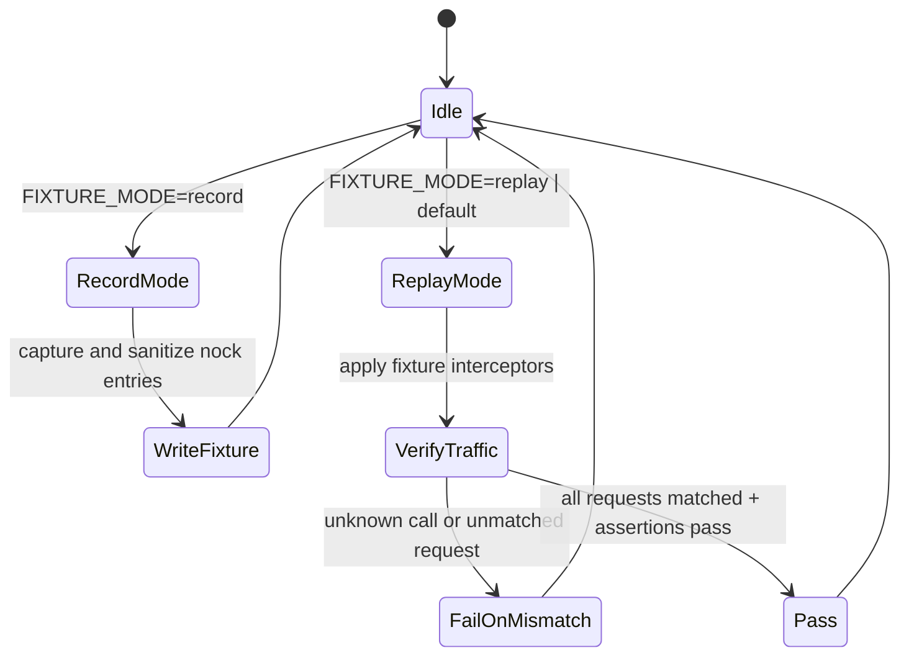
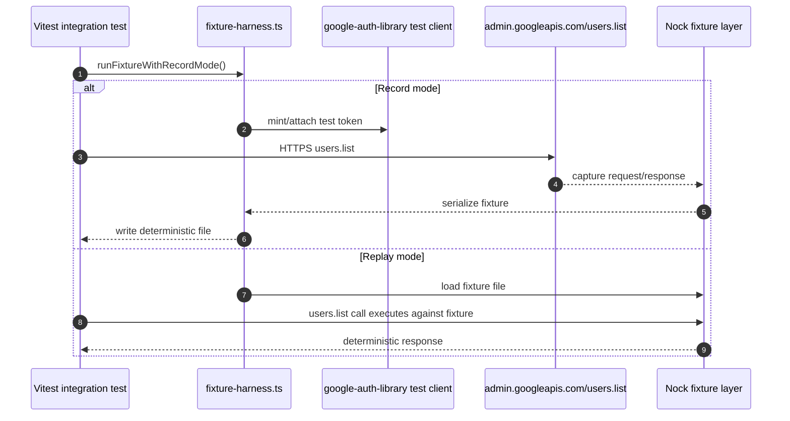

# GST-7 Test Strategy and Fixture Architecture (Phase 0)

## 1) Scope and test pyramid

### Pyramid target (phase-aligned)

- **Unit tests (fast):** pure mapping, contract helpers, in-memory logic, and edge checks.
- **Integration tests (shared infra):** adapter integration against recorded fixtures (Microsoft Graph and Google Admin SDK) and deterministic replay.
- **Sandbox-E2E (contract + API smoke):** one smoke path per interface (Graph, Google Admin SDK, API route, web UI) executed against stable sandbox tenants when available.
- **Browser-E2E (Playwright):** one smoke spec in `apps/web/tests/e2e` for smoke navigation and core rendering semantics.

### Acceptance alignment

- `pnpm turbo run test` is the PR gate for **unit + integration + contract** tests.
- `vitest` is the shared runner across all workspace packages.
- Replay-based fixture recordings provide deterministic, network-free runs in CI.

## 2) Test classifications and ownership

| Layer | Responsible owner | Current artifacts | Completion signal |
|---|---|---|---|
| Unit | Devs + QA | `*.test.ts` in `packages/*/test` and `apps/*/test` | no fixture/network required |
| Contract | QA + Staff Engineer | `runIdentityProviderContractSuite` | `IdentityProvider` methods satisfy common contract |
| Integration | QA | fixture harness + recorded requests | deterministic fixture replay pass |
| Sandbox-E2E | QA + Release Engineer | phase-2 follow-up pipelines | real tenant call pass for `users.list` in both ecosystems |
| Browser-E2E | QA + Staff Engineer | `apps/web/tests/e2e/smoke.spec.ts` | one smoke spec target only in v0.1 |

## 3) Data flow and component boundaries

## 4) Fixture model and policies

### Canonical rule
All third-party traffic that is expensive, rate-limited, or externalized is recorded once and replayed in CI.

### Storage layout
- Graph recordings in `tools/test/fixtures/microsoft-graph/`
- Google Admin recordings in `tools/test/fixtures/google-admin/`
- Deterministic redactions are applied before write (`access tokens`, IDs, timestamps, request ids)

### Failure injection policy
- Default policy: **hard-fail** on fixture drift unless refresh/re-record is approved by QA.
- For CI:
  - replay mode must be used unless explicit env override enables record mode
  - fixture mismatch should surface as an explicit error with fixture name in output
- For debugging:
  - fixture mode is opt-in via env var and produces a single, auditable file.

## 5) Failure-injection policy

1. **Timeout path:** simulate by fixture-level fault payloads and adapter-level retry assertions.
2. **Quota path:** inject quota-like responses and assert bounded retry and mapped errors.
3. **Authorization path:** inject `invalid_grant`/401 equivalents and assert re-auth hooks and fallback behavior.
4. **Not-found path:** assert stable contract error codes and audit invariants.
5. **Dual-provider conflict path:** partial failure matrix remains the default regression shape for `suspendUser`/`resumeUser`.

## 6) Sandbox tenant ownership model

| Tenant family | Owner | Primary responsibility | Escalation condition |
|---|---|---|---|
| Microsoft Graph tenant | Release Engineer + QA | provisioning + daily viability checks | stale tenant, tenant lockout, failed renewal |
| Google Workspace tenant | Release Engineer + QA | provisioning + OAuth/service-account refresh checks | OAuth drift, user import failure, tenant lockout |

## 7) Diagrams

### State model for fixture lifecycle

### Sequence (Google users.list fixture capture/replay)

## 8) CI and rollout

- Phase 0 target: `pnpm turbo run test` must remain green on PR.
- Playwright config/smoke target is provided in `apps/web` and can be introduced into CI as soon as e2e runner is approved.
- PR reviewers: CTO + Staff Engineer (lineage for this issue).
